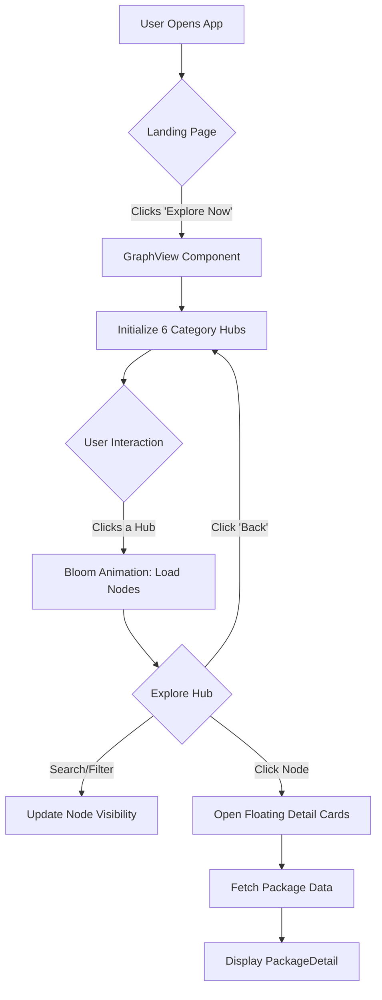

# 🏛️ Z-TOUR: Presentation & Documentation Guide

This document is designed to help you explain your Final Year Project (FYP) to your examiners. It breaks down the technical concepts into simple, presentable points.

---

## 🗺️ Project Overview
**Z-TOUR** is an immersive 3D visualization platform designed to showcase tourism in Pakistan. Instead of traditional lists or maps, it uses a **Force-Directed Graph** to represent destinations as a connected "galaxy," allowing users to explore the relationship between different locations.

### Key Presentation Points:
- **Innovation:** Reimagining travel discovery through 3D interaction.
- **Technology:** Built with modern web tools (React, Three.js, and Framer Motion).
- **User Experience:** High-performance animations and intuitive 3D navigation.

---

## 🔄 Project Flow Chart
This diagram represents the user journey and how the application handles logic.

---

## 📦 Component Breakdown (How it works)

### 1. `App.jsx` (The Orchestrator)
- **Role:** The brain of the application.
- **Explanation:** It manages which screen the user sees. It uses "State" to swap between the **Landing Page** and the **Graph View**.
- **Presentation Tip:** "Think of this as the traffic controller that ensures smooth transitions between different parts of the app."

### 2. `LandingPage.jsx` (The Visual Hook)
- **Role:** First impression and welcome.
- **Key Features:** Uses "Ambient Meshes" and "Floating Motes" (small particles) created with **Framer Motion** to create a premium feel.
- **Presentation Tip:** "We use physics-based animations here to immediately signal to the user that this is a high-tech, interactive experience."

### 3. `GraphView.jsx` (The 3D Engine)
- **Role:** The core feature where the 3D graph is rendered.
- **Key Features:** Uses **Three.js** logic to render spheres (nodes) and lines (links). It calculates camera positions to "zoom in" on a destination when clicked.
- **Presentation Tip:** "This is where the 'Force-Directed' logic lives. The nodes push away from each other automatically to create an organized, readable layout in 3D space."

### 4. `FloatingCards.jsx` & `FilterBar.jsx` (The UI Layer)
- **Role:** Providing information and control.
- **Explanation:** FilterBar filters the array of destinations in real-time. FloatingCards display data fetched from our local data files.

---

## 💾 Data Flow (How data moves)

1. **Source:** Data is stored in `src/data/destinations.js` (locations) and `src/data/packages.js` (travel details).
2. **Processing:** When the `GraphView` loads, it maps these JS objects into "Nodes" and "Links" that the 3D engine understands.
3. **Filtering:** When you type in the search bar, the app "filters" the list. The 3D engine then updates the opacity and size of the nodes to highlight your search.

---

## 🎤 Presentation "Cheat Sheet"

| If they ask about... | You should say... |
| :--- | :--- |
| **Why 3D?** | "To provide a sense of scale and connection that 2D maps fail to capture, making the exploration process more engaging." |
| **Performance?** | "We use Three.js which utilizes the user's GPU (graphics card) to ensure smooth 60fps movement even with many nodes." |
| **Scalability?** | "The data is decoupled from the UI. Adding a new destination is as simple as adding one line to the `destinations.js` file." |
| **Animations?** | "We use Framer Motion for UI transitions and D3-Force algorithms for the 3D graph physics." |

---

> [!TIP]
> **Pro Presenter Move:** During your demo, click a node and show how the camera "flies" to it. Mention that this is "Dynamic Camera Projection" - it sounds very impressive to examiners!
