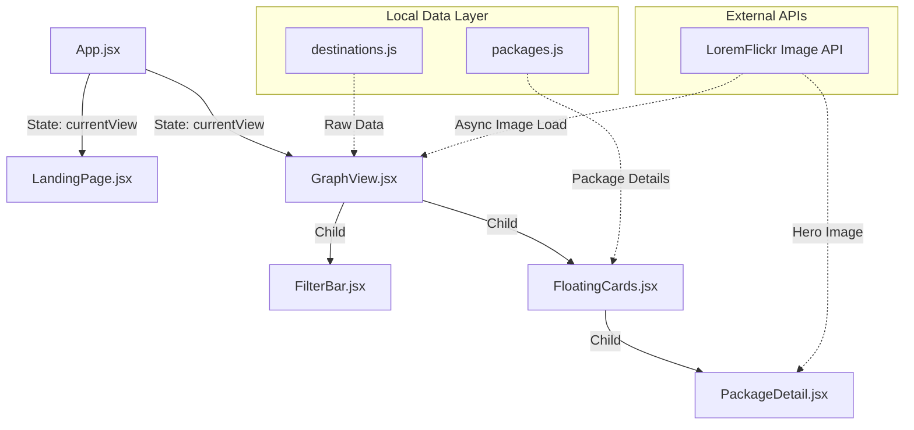

# 🏛️ Z-TOUR: Technical Documentation & Insights

This document provides a comprehensive technical overview of the **Z-TOUR** application, detailing the architecture, the specific role of every library used, how external APIs are integrated, and deep technical insights into how the system operates.

---

## 🚀 1. The Technology Stack: Libraries & Tools

Z-TOUR relies on a carefully selected stack of modern web technologies. Here is a detailed breakdown of every tool and why it was chosen:

### Core Framework & Build
*   **[React 19](https://react.dev/)**: The core UI framework. We heavily utilize React's hooks (`useState`, `useEffect`, `useMemo`, `useCallback`) to manage the complex state of the 3D graph (like selected nodes, active filters) without causing unnecessary re-renders of the WebGL canvas.
*   **[Vite](https://vitejs.dev/)**: The build tool. Chosen over Webpack because it serves source code over native ESM, resulting in near-instant Hot Module Replacement (HMR) during development, which is critical when tweaking 3D visuals.

### 3D Rendering & Physics
*   **[react-force-graph-3d](https://github.com/vasturiano/react-force-graph-3d)**: The primary engine for the "Galaxy" view. This library combines a 3D renderer with a physics engine. It uses the `d3-force-3d` algorithm to simulate physical forces (charge/repulsion between nodes and spring forces along links) to automatically organize the destinations into a readable cluster.
*   **[Three.js](https://threejs.org/)**: The underlying WebGL library. While `react-force-graph-3d` handles the physics, we drop directly down into raw Three.js APIs within the `nodeThreeObject` function to create custom visual representations (like Sprites, CanvasTextures, and SphereGeometries) that the default graph library cannot do out-of-the-box.

### UI Styling & Animation
*   **[Framer Motion](https://www.framer.com/motion/)**: The animation engine for the 2D UI. We use it for physics-based spring animations (e.g., cards popping up) and `AnimatePresence` to smoothly mount/unmount React components like the `PackageDetail` modal without jarring cuts.
*   **[Tailwind CSS (v4)](https://tailwindcss.com/)**: Utility-first CSS framework. Used to rapidly build the responsive layouts and apply complex "Glassmorphism" effects (combining `backdrop-filter: blur`, semi-transparent `rgba` backgrounds, and subtle borders).
*   **[Lucide React](https://lucide.dev/)**: The iconography library. Provides clean, customizable SVG icons (e.g., the Search icon, Stars for ratings) that scale perfectly across devices.

---

## 📍 2. Core Technologies & Source Locations

Below is a detailed map of where each technology is implemented in the source code.

### 🎨 HTML5 Canvas (2D Drawing in 3D)
| File | Line Number(s) | Usage Description |
| :--- | :--- | :--- |
| **`src/components/GraphView.jsx`** | 240 - 243 | Creation of the off-screen canvas and 2D context for each node. |
| **`src/components/GraphView.jsx`** | 258 - 315 | Drawing of the **Octagonal Hub Collages** using `drawOctagon` and `drawImage`. |
| **`src/components/GraphView.jsx`** | 358 - 423 | Drawing of the **Hexagonal Destination Nodes** using `drawHexagon` and `drawImage`. |
| **`src/components/GraphView.jsx`** | 318, 425 | Conversion of 2D Canvas to `THREE.CanvasTexture`. |

### 🎥 Framer Motion (Animations)
| File | Line Number(s) | Usage Description |
| :--- | :--- | :--- |
| **`src/App.jsx`** | 24 | `<AnimatePresence>` for smooth transitions between Landing and Graph views. |
| **`src/components/LandingPage.jsx`** | 50 - 100 | Complex physics-based particle animations (`FloatingMotes`). |
| **`src/components/LandingPage.jsx`** | 140 - 160 | Staggered text reveals for the main title and CTA. |
| **`src/components/GraphView.jsx`** | 15 - 50 | Animated radial "Light Washes" in the background using `motion.div`. |
| **`src/components/GraphView.jsx`** | 511, 514, 557 | `<AnimatePresence>` for UI elements (FilterBar, Legend, FloatingCards). |
| **`src/components/PackageDetail.jsx`** | 38 - 51 | Spring-based entrance animation for the detail modal. |
| **`src/components/FilterBar.jsx`** | 14 - 20 | Slide-in animation for the search/filter panel. |

### 🧊 Three.js & 3D Force Graph
| File | Line Number(s) | Usage Description |
| :--- | :--- | :--- |
| **`src/components/GraphView.jsx`** | 4 | Primary Three.js import (`import * as THREE`). |
| **`src/components/GraphView.jsx`** | 162 - 170 | Scene lighting setup (`AmbientLight` and `DirectionalLight`). |
| **`src/components/GraphView.jsx`** | 185 | The `nodeThreeObject` callback—the heart of the 3D renderer. |
| **`src/components/GraphView.jsx`** | 321, 430 | `new THREE.Sprite()` used to create billboarded nodes. |
| **`src/components/GraphView.jsx`** | 543 | Implementation of the `<ForceGraph3D>` component. |

### 🏷️ Lucide React (Icons)
| File | Line Number(s) | Icons Used |
| :--- | :--- | :--- |
| **`src/components/FilterBar.jsx`** | 2 | `Search`, `X` (Search controls). |
| **`src/components/PackageDetail.jsx`** | 3 | `Star`, `MapPin`, `Navigation`, `Mountain`, `Building2`, `Landmark`, `Clock`, `Users`, `Gauge`, `Check`. |
| **`src/components/GraphView.jsx`** | 5 | `ArrowLeft` (Back button navigation). |

---

## 🌐 3. APIs and External Services

To keep the application lightweight and dynamic without needing a complex backend database, we utilize external APIs for media generation.

### The LoremFlickr API (`loremflickr.com`)
*   **What it is**: A dynamic image placeholder service.
*   **Usage**: Fetching unique destination images in `GraphView.jsx` (Line 80) and `PackageDetail.jsx` (Line 77).
*   **Technical Insight (The Caching Strategy)**: 
    Fetching images dynamically directly inside a 3D rendering loop is dangerous because the canvas updates 60 times a second. To solve this, we built a custom **`ImageCache` (a JavaScript `Map`)** inside `GraphView.jsx` (Line 183). 
    When the graph tries to draw a node, it checks the cache. If the image isn't there, it marks it as `'loading'` and initiates an asynchronous `Image()` request. Once loaded, the image is cached in memory, and we trigger a specific `needsUpdate = true` flag on the WebGL material to redraw that specific node. This ensures zero network bottlenecking while panning around the 3D space.

---

## 🏗️ 4. System Architecture & Data Flow

### Architecture Diagram



### The Data Enrichment Pipeline

Data flows from static local files to dynamic 3D objects through a specific pipeline:

1.  **Static Load**: Raw destination data (Name, Links, Category) is imported from `destinations.js`.
2.  **Enrichment (`useMemo` in GraphView)**: At line 73, the data is mapped to automatically calculate category Hubs and inject dynamic API URLs.
3.  **Graph Transformation**: At line 84, the enriched array is split into a **Nodes array** (Hubs + Destinations) and a **Links array**.
4.  **Real-time Interaction**: When the user types in the `FilterBar`, React state changes. This triggers the `isNodeVisible` function (Line 150), which hides non-matching nodes. The `react-force-graph` detects this data change and instantly animates the layout adjustment.

---

## 🎨 5. Deep Technical Insights: How the Magic Works

### A. Custom HTML5 Canvas to WebGL Rendering
The most technically complex part of the app is how we render the Hexagonal and Octagonal nodes. WebGL (Three.js) does not natively understand complex 2D shapes or text easily.
*   **The Solution**: We create a hidden, off-screen HTML5 `<canvas>` for every visible node.
*   **The Drawing Process**: We use standard 2D context commands (`lineTo`, `clip`, `drawImage`) to draw an Octagon or Hexagon, fill it with the API image, and draw the text labels on top.
*   **The Conversion**: We convert this 2D canvas into a `THREE.CanvasTexture`. This texture is then wrapped around a `THREE.Sprite`. A Sprite is a special 3D plane that mathematically always rotates to face the camera (Billboarding), creating the illusion of 2D UI elements floating perfectly in a 3D world.

### B. Dynamic Camera Flight
To make navigation immersive, clicking a node triggers a mathematical camera flight.
*   **The Math**: At line 465, we calculate a `distRatio` based on the node's current `x, y, z` coordinates to position the camera a specific distance away, regardless of where the node is floating in the cluster.
```javascript
const distRatio = 1 + distance / Math.hypot(node.x, node.y, node.z);
fgRef.current.cameraPosition(
  { x: node.x * distRatio, y: node.y * distRatio, z: node.z * distRatio },
  node, 1500 // 1.5 second animation duration
);
```

### C. The 4-Layer Atmospheric Background
To create a "Cinematic" feel without confusing the 3D depth perception, the background uses a complex CSS composite:
1.  **Cinematic Base**: A blurred mountain image generated via AI.
2.  **Topographic Overlay**: An SVG-style contour map image set to `mix-blend-mode: screen` so only the glowing cyan lines show through.
3.  **Vignette Tint**: A radial gradient using `mix-blend-mode: multiply` to darken the edges, keeping the center bright while ensuring white text remains legible.
4.  **Animated Washes**: Three Framer Motion divs that slowly float around, acting as atmospheric "glowing dust" behind the 3D galaxy.
